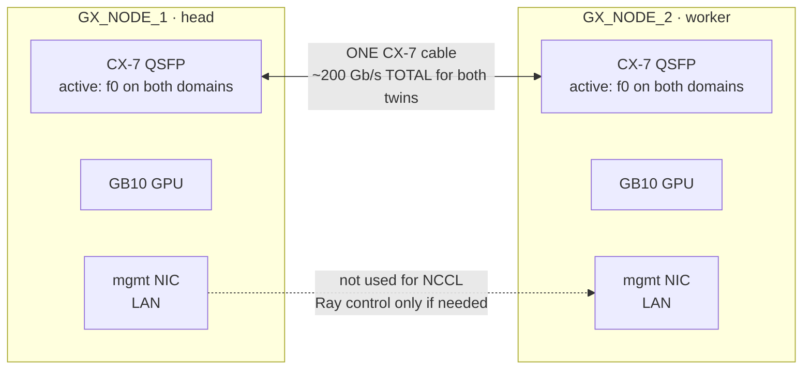
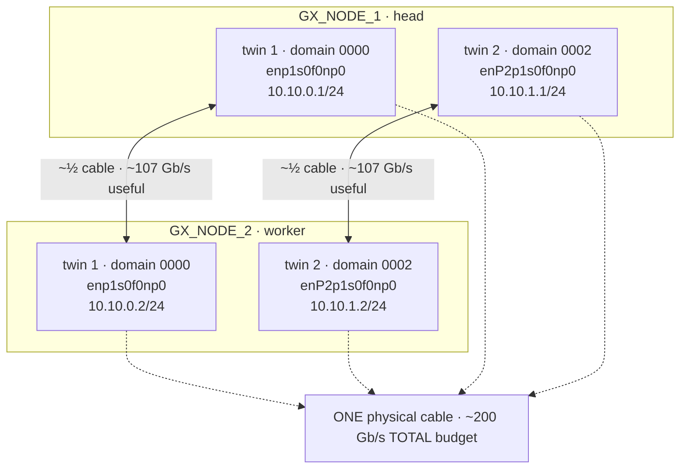
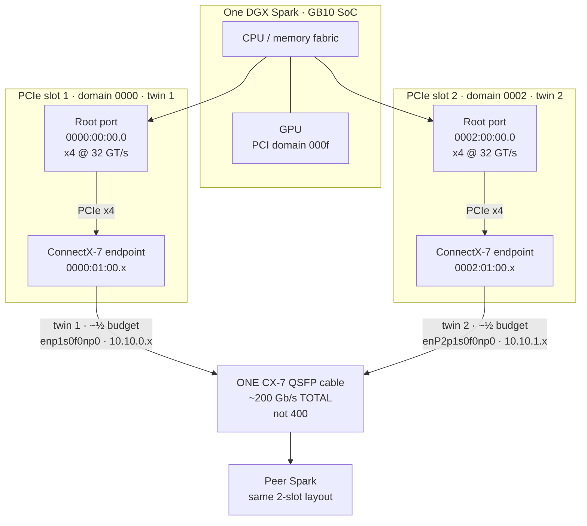
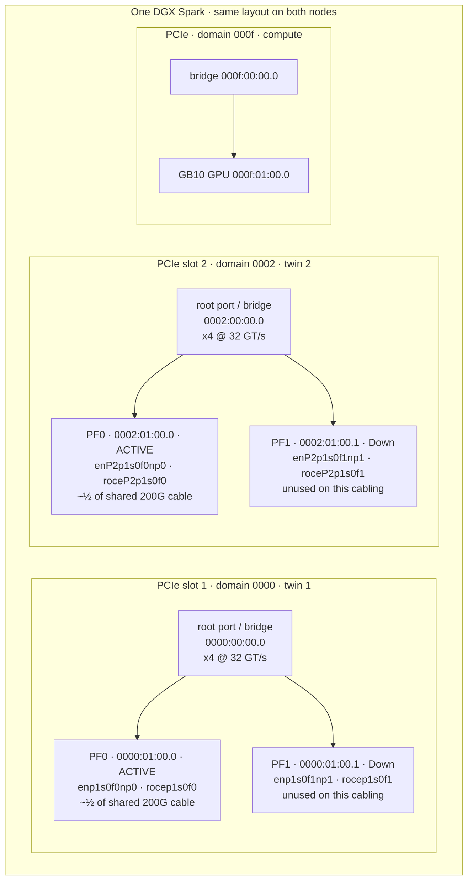
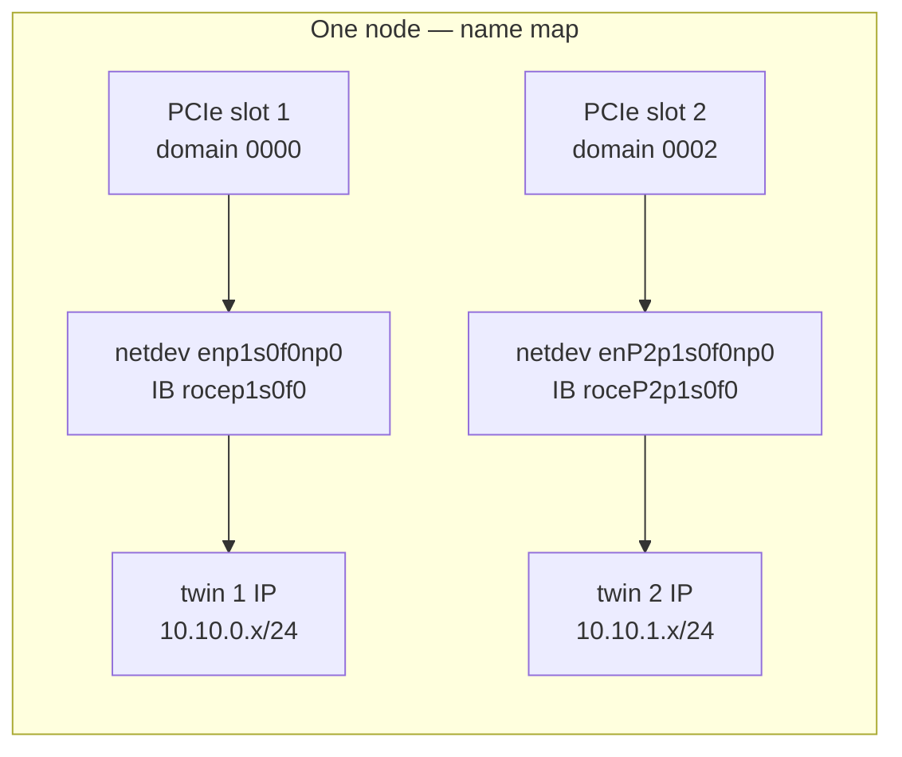
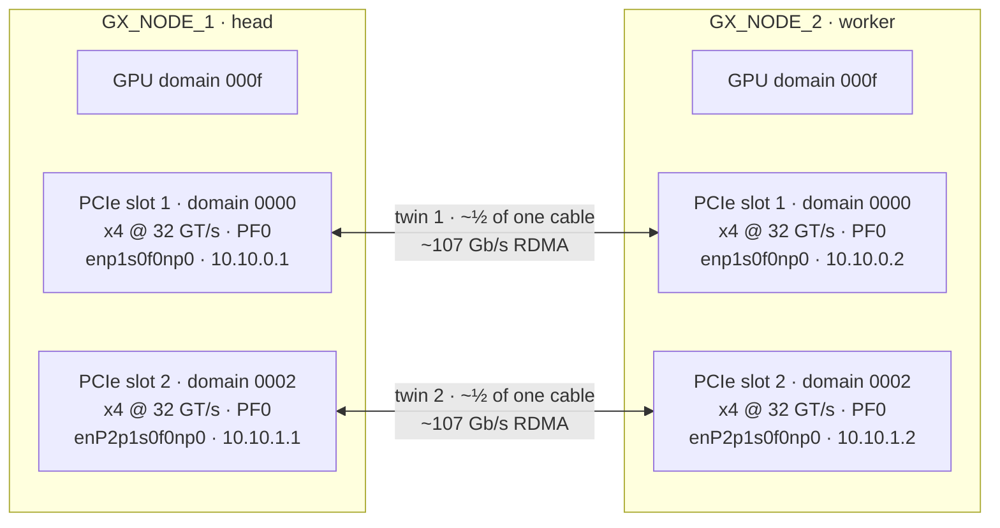
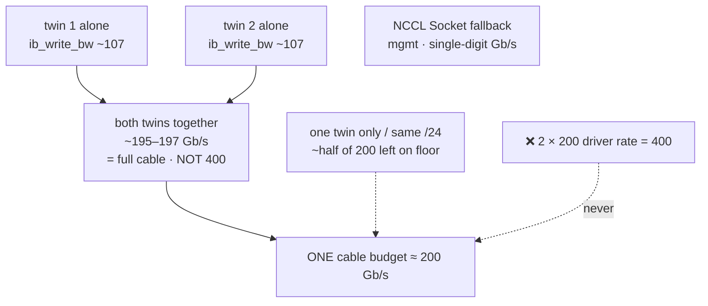
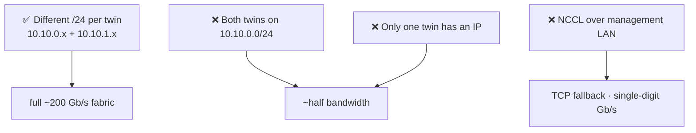

# Dual Spark Topology — Cable, Twins, PCI Domains

Visual map of a **2-node single-cable** DGX Spark pair (GB10 / SM121).
Companion to [`DUAL_SPARK_SETUP.md`](./DUAL_SPARK_SETUP.md). For setup
commands, IPs, UFW, NCCL, and troubleshooting, use the runbook; this file
is the picture.

Hostnames in this public doc are placeholders only: **`GX_NODE_1`** (head)
and **`GX_NODE_2`** (worker) — same convention as the runbook. Substitute
your own names; nothing here is meant to match a real inventory label.
Interface names, PCI domains, and the `10.10.0.0/24` + `10.10.1.0/24` fabric
plan were checked on a working GB10 pair with the cable seated.

---

## Read this first — one cable, ~200 Gb/s total (not 400)

People see **two** PCIe slots, **four** mlx5 devices, and two ports each
reporting something like `200 Gb/sec (2X NDR)` and do the wrong math
(`2 × 200 = 400`). That is **not** how this topology works.

```text
  ┌─────────────┐         ONE physical CX-7 cable          ┌─────────────┐
  │  GX_NODE_1  │ ═══════════════════════════════════════ │  GX_NODE_2  │
  └─────────────┘     carries the WHOLE fabric budget      └─────────────┘
                              │
              ┌───────────────┴───────────────┐
              │  TOTAL ≈ 200 Gb/s line rate   │
              │  (not 400 — do not multiply)  │
              └───────────────┬───────────────┘
                              │
              ┌───────────────┴───────────────┐
              │                               │
        twin 1 path                     twin 2 path
     ~½ of the cable                  ~½ of the cable
   ~100 Gb/s useful                 ~100 Gb/s useful
   (~107 measured)                  (~107 measured)
              │                               │
              └───────────────┬───────────────┘
                              │
                    both together ≈ 195–197 Gb/s
                    (≈ full 200 — still not 400)
```

| What you see in software | What it actually means |
|---|---|
| 1 QSFP cable between the boxes | **The only wire.** All fabric traffic shares it. |
| 2 PCIe slots / domains (`0000`, `0002`) | Two **paths into** that one cable (multipath / twin split), not two full cables |
| 4 mlx5 functions (2 slots × PF0+PF1) | Dual-port silicon under each slot; usually **2 Up + 2 Down** — still one cable |
| Each Up port shows `200 Gb/s 2X NDR` | Driver link report per twin — **not** “add them for 400” |
| `ib_write_bw` ~107 + ~107 ≈ 195–197 | Real useful RDMA — saturates the **~200 Gb/s** cable budget |

**Bottom line:** one cable handles it all. Ceiling is **~200 Gb/s aggregate**.
Two twins exist so NCCL/RDMA can use **both halves** of that budget (two
`/24`s, two NICs). Configure only one twin and you leave ~half on the floor
— you do **not** unlock a second 200 by plugging magic.

---

## 0. Reference layout (verified pattern)

| Role | Placeholder host | Twin 1 | Twin 2 | Mgmt |
|---|---|---|---|---|
| head | `GX_NODE_1` | `10.10.0.1/24` on `enp1s0f0np0` | `10.10.1.1/24` on `enP2p1s0f0np0` | separate LAN NIC (not fabric) |
| worker | `GX_NODE_2` | `10.10.0.2/24` on `enp1s0f0np0` | `10.10.1.2/24` on `enP2p1s0f0np0` | separate LAN NIC (not fabric) |

Typical `ibdev2netdev` when the single cable is seated on the **PF0**
orientation (identical pattern on both boxes):

```
rocep1s0f0   port 1 ==> enp1s0f0np0   (Up)     # twin 1 · ACTIVE  (~½ of the 200G cable)
rocep1s0f1   port 1 ==> enp1s0f1np1   (Down)   # unused PF on this cabling
roceP2p1s0f0 port 1 ==> enP2p1s0f0np0 (Up)     # twin 2 · ACTIVE  (~½ of the 200G cable)
roceP2p1s0f1 port 1 ==> enP2p1s0f1np1 (Down)   # unused PF on this cabling
# 2 Up + 2 Down = still ONE cable · ~200 Gb/s total, not 4× or 2× 200
```

Also confirmed on a healthy pair: ping both `/24`s, jumbo
`ping -M do -s 8000`, MTU **9000** on the Up ifaces, PCI domains `0000` /
`0002` (CX-7) + `000f` (GPU) on both nodes, `nvidia-smi topo` GPU↔NIC = NODE.

> If your cable seats on the other QSFP orientation, the **Up** pair may
> be `…f1` instead of `…f0`. Domains and IP plan stay the same — only the
> PF letter changes. Always trust `ibdev2netdev` on *your* box.

---

## 1. Physical — two boxes, one cable



- **One physical cable** carries the **entire** fabric — both twins, all
  RDMA, all NCCL. No second data cable, no switch required.
- Budget is **~200 Gb/s total** on that cable. Two twins **share** it
  (~half each when both are healthy). They do not stack to 400.
- Management Ethernet is separate (home LAN / office switch). Do not put
  NCCL or model traffic on it — if RDMA fails, NCCL falls back to TCP
  there and you get single-digit Gb/s.
- Cable which QSFP “side” varies by SKU; trust `ibdev2netdev` for which
  interfaces show `Up` after the cable is seated.

---

## 2. Logical twins — two paths on the same ~200 Gb/s cable

Software shows **two** fabric NICs (“twins”) because the SoC has **two
PCIe slots** into the CX-7 path (§3). That is multipath into **one**
cable, not two independent 200G links.

| | Twin 1 | Twin 2 | Cable total |
|---|---|---|---|
| Share of the wire | ~½ | ~½ | **~200 Gb/s** |
| Measured `ib_write_bw` | ~107 Gb/s | ~107 Gb/s | **~195–197 Gb/s** (both) |
| Wrong mental model | “200 + 200 = 400” | | **No — still ~200** |

To use **both halves**, each twin needs its **own `/24`**. One twin only
(or both on the same `/24`) → you leave about half the cable idle.



ASCII (paste-friendly):

```
        GX_NODE_1 (head)                    GX_NODE_2 (worker)
twin 1:  10.10.0.1  enp1s0f0np0   ══════   10.10.0.2  enp1s0f0np0   ~½ cable (~107)
twin 2:  10.10.1.1  enP2p1s0f0np0 ══════   10.10.1.2  enP2p1s0f0np0  ~½ cable (~107)
         \__________________ ONE cable · ~200 Gb/s TOTAL __________________/
                              both twins ≈ 195–197 measured
                              (full cable — NOT 400)
```

### Why different `/24`s matter

| Twin IPs | Result |
|---|---|
| `10.10.0.1` + `10.10.1.1` (different `/24`) | Both twins used · full fabric |
| Both on `10.10.0.0/24` (same `/24`) | Routing / NCCL subnet-aware path breaks · **~half bandwidth** |

eugr’s `autodiscover.sh` errors if both fabric NICs share a subnet — treat
that as a feature, not noise.

---

## 3. Per-node PCI — two slots into one cable

This is the hardware picture behind “twins.” Read it together with the
**~200 Gb/s total, not 400** note at the top.

Each Spark does **not** hang the fabric off a single PCIe root. The
ConnectX-7 path shows up as **two independent PCIe root ports** (think:
**two PCIe slots** into the SoC). Each root is its own PCI **domain**,
each host link is **x4 @ 32 GT/s** (measured live on GB10), and each
domain is one twin — **half of the shared cable**, not its own 200G pipe.

| Twin | PCI domain | Root bridge (slot) | CX-7 endpoint | Host PCIe (live) | Share of **one** cable |
|---|---|---|---|---|---|
| 1 | `0000` | `0000:00:00.0` (`10de:22ce`) | `0000:01:00.0` + `.1` | **x4 · 32 GT/s** | ~½ of ~200 Gb/s |
| 2 | `0002` | `0002:00:00.0` (`10de:22ce`) | `0002:01:00.0` + `.1` | **x4 · 32 GT/s** | ~½ of ~200 Gb/s |
| — | `000f` | `000f:00:00.0` | GPU `000f:01:00.0` | separate root | compute, not fabric |

So: **2 PCIe slots → 2 twin paths → 1 physical cable (~200 Gb/s total)**.
Lose one domain’s IP/config and you only get ~half of that 200 — that is
why the runbook insists on two `/24`s. You never get 400 from this SKU.

### 3.1 Big picture — SoC → two PCIe slots → one ~200G cable



### 3.2 Zoom — each slot is a dual-function CX-7

Under each root port the CX-7 appears as **two PCI functions** (PF0 +
PF1). That is dual-port silicon, not a second slot. On the common single-
cable seating only **one PF per domain** has carrier; the other stays
`Down`.



### 3.3 How the two slots map to software names



| Layer | Slot 1 / twin 1 | Slot 2 / twin 2 | Shared cable |
|---|---|---|---|
| PCI domain | `0000` | `0002` | — |
| Root port BDF | `0000:00:00.0` | `0002:00:00.0` | — |
| Active CX-7 PF | `0000:01:00.0` | `0002:01:00.0` | — |
| netdev | `enp1s0f0np0` | `enP2p1s0f0np0` | — |
| RDMA device | `rocep1s0f0` | `roceP2p1s0f0` | — |
| Example head IP | `10.10.0.1/24` | `10.10.1.1/24` | — |
| Example worker IP | `10.10.0.2/24` | `10.10.1.2/24` | — |
| Host PCIe | x4 @ 32 GT/s | x4 @ 32 GT/s | — |
| Share of wire | ~½ (~107 useful) | ~½ (~107 useful) | **~200 Gb/s total** |
| Driver may show | `200 Gb/s 2X NDR` | `200 Gb/s 2X NDR` | **Do not add → 400** |

Note the capital **`P`** in `enP2…` / `roceP2…`: Linux’s predictable
names encode multi-domain PCI. Domain `0002` → `enP2…`. Domain `0000` →
plain `enp1…`. Same driver (`mlx5_core`), two different roots.

### 3.4 ASCII PCI tree (`lspci -tv`)

Identical pattern on both nodes of a healthy pair:

```
-[0000:00]---00.0-[01]--+-00.0  ConnectX-7  →  enp1s0f0np0   / rocep1s0f0   ACTIVE } slot 1 / twin 1
                        \-00.1  ConnectX-7  →  enp1s0f1np1   / rocep1s0f1   Down   }   (x4 @ 32 GT/s)
-[0002:00]---00.0-[01]--+-00.0  ConnectX-7  →  enP2p1s0f0np0 / roceP2p1s0f0 ACTIVE } slot 2 / twin 2
                        \-00.1  ConnectX-7  →  enP2p1s0f1np1 / roceP2p1s0f1 Down   }   (x4 @ 32 GT/s)
-[000f:00]---00.0-[01]----00.0  GB10 GPU
```

Quick read of link width/speed yourself:

```bash
for d in 0000:00:00.0 0000:01:00.0 0002:00:00.0 0002:01:00.0; do
  echo -n "$d  "
  echo -n "width=$(cat /sys/bus/pci/devices/$d/current_link_width)  "
  echo "speed=$(cat /sys/bus/pci/devices/$d/current_link_speed)"
done
# expect: width=4  speed=32.0 GT/s PCIe   on all four
```

### 3.5 Interface / PF notes

- **Two slots ≠ two cables ≠ 400 Gb/s.** You will not see discrete CX-7
  add-in cards. You see **two PCIe root domains** and four mlx5 functions
  (2 slots × 2 PFs). Only **two** are usually `Up`. All of that still
  rides **one** QSFP cable with a **~200 Gb/s** budget.
- **Four functions are not four full-rate pipes.** PF1 on each slot is
  typically `Down` on this cabling. Even both `Up` twins only sum to the
  single-cable ceiling.
- **`enp…` vs `enP…`** — multi-domain naming (`enP2…` = domain `0002`).
- **Which PF is cabled** (`…f0` vs `…f1`) depends on QSFP orientation.
  Diagrams show the common case: **PF0 ACTIVE on both slots**. After
  cabling, only the active pair shows carrier / `Up` (driver may print
  `200 Gb/sec (2X NDR)` per twin — remember the shared budget); the other
  PF stays `Down` at a dummy 40 Gb/s.
- **Always map live:**

```bash
ibdev2netdev
# example when cable is seated on PF0 both domains:
#   rocep1s0f0   port 1 ==> enp1s0f0np0   (Up)    # slot 1
#   roceP2p1s0f0 port 1 ==> enP2p1s0f0np0 (Up)    # slot 2

ip -br addr | grep 10.10
lspci -d 15b3:          # four CX-7 functions (two slots × two PFs)
lspci -tv               # see the two root domains clearly
```

### 3.6 `nvidia-smi topo` (GPU vs the two slots)

On a healthy Spark the GPU is **NODE** to all fabric NICs (same host-
bridge neighborhood). The two PFs of **one** slot are **PIX** to each
other. The two slots are **NODE** to each other (not the same PCIe
bridge).

```
        GPU0  NIC0  NIC1  NIC2  NIC3
 GPU0    X    NODE  NODE  NODE  NODE
 NIC0   NODE   X    PIX   NODE  NODE     NIC0/1 = slot 1 · domain 0000
 NIC1   NODE  PIX    X    NODE  NODE
 NIC2   NODE  NODE  NODE   X    PIX      NIC2/3 = slot 2 · domain 0002
 NIC3   NODE  NODE  NODE  PIX    X
```

You do **not** need NUMA pinning for the basic dual-Spark recipe; this
table is the software view of “two PCIe slots.”

---

## 4. End-to-end fabric (both nodes)

Putting PCI + IPs together for the full pair:



Both arrows are the **same physical cable**. Together they approach
**~200 Gb/s**, not 400.

NCCL / vLLM TP=2 uses both twins when:

1. Both twins have IPs on **different** `/24`s  
2. MTU 9000 both sides  
3. UFW allows both `10.10.0.0/24` and `10.10.1.0/24`  
4. Container env has direct-link NCCL overrides (`NCCL_NET_PLUGIN=none`,
   subnet-aware routing, merge-nics off, correct GID) — see runbook §2.7

Expected log signal: `NET/IB`, not `NET/Socket`.

---

## 5. Bandwidth map (what “healthy” looks like)



| Check | Expect | Do **not** read as |
|---|---|---|
| Physical cables | **1** QSFP between the two Sparks | “need 2 cables for 2 twins” |
| Driver rate per Up twin | often `200 Gb/sec (2X NDR)` ACTIVE | “each twin is a free 200 → 400 total” |
| `ib_write_bw` per twin | ~107 Gb/s | full cable by itself |
| Both twins | ~195–197 Gb/s aggregate | anything near 400 |
| Only one twin / same subnet | ~half of ~200 | “broken NIC” necessarily |
| NCCL on `NET/Socket` | single-digit Gb/s | fabric problem, not model size |

Paste-ready `ib_write_bw` commands live in the runbook §3.3.

---

## 6. Common topology mistakes (picture form)



---

## 7. Quick verify (after cabling)

```bash
# 1. Which fabric ifaces are live?
ibdev2netdev

# 2. Both twins addressed?
ip -br addr | grep 10.10
# head:   10.10.0.1/24  and  10.10.1.1/24
# worker: 10.10.0.2/24  and  10.10.1.2/24

# 3. Jumbo frames both paths
ping -c 2 -M do -s 8000 10.10.0.2
ping -c 2 -M do -s 8000 10.10.1.2

# 4. PCI domains present (two CX-7 roots + GPU)
lspci -d 15b3:
lspci -d 10de: | head
```

If step 1 shows only one `Up`, reseat the cable / try the other QSFP
orientation before rewriting NetworkManager config.

---

## 8. Out of scope

- **3+ Sparks / mesh / 4-port** — different routing story. See the
  [6× Spark forum thread](https://forums.developer.nvidia.com/t/6x-spark-setup/354399/56).
- **Power path / UPS / TFLOP/s oracle** — runbook §0 and `gpu_stress.py`.
- **Launcher patches, UFW, SSH, registry** — runbook §2–§4.

---

## References

- Runbook: [`DUAL_SPARK_SETUP.md`](./DUAL_SPARK_SETUP.md)
- NVIDIA dual-Spark playbook:
  <https://github.com/NVIDIA/dgx-spark-playbooks/blob/main/nvidia/connect-two-sparks/README.md>
- eugr networking deep-wiki:
  <https://deepwiki.com/eugr/spark-vllm-docker/7-dgx-spark-networking>
- Spark clustering docs:
  <https://docs.nvidia.com/dgx/dgx-spark/spark-clustering.html>
